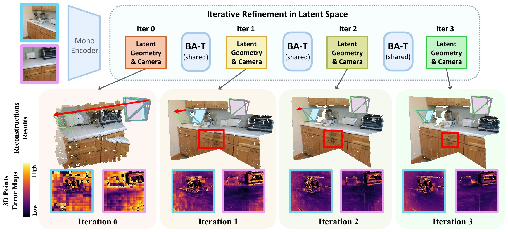

<!-- PROJECT LOGO -->
<p align="center">
  
</p>
<h1 align="center">
  BA-T: An Iterative Transformer for Two-View Bundle Adjustment
</h1>

<p align="center">
  <a href="https://ganlinzhang.xyz" target="_blank"><strong>Ganlin Zhang<sup>1,2</sup></strong></a>
  ·
  <a href="https://wrchen530.github.io/" target="_blank"><strong>Weirong Chen<sup>1,2</sup></strong></a>
  ·
  <a href="https://cvg.cit.tum.de/members/cremers" target="_blank"><strong>Daniel Cremers<sup>1,2</sup></strong></a>
  ·
  <a href="https://xiwang1212.github.io/homepage/" target="_blank"><strong>Xi Wang<sup>1,2,3</sup></strong></a>
</p>
<p align="center">
  <strong><sup>1 </sup>TU Munich, <sup>2 </sup>MCML, <sup>3 </sup>ETH Zurich</strong>
</p>
<h3 align="center">NeurIPS 2026</h3>
<h4 align="center">
  <a href="https://arxiv.org/abs/2606.03287" target="_blank">arXiv</a>
  |
  <a href="https://zhangganlin.github.io/BA-T/" target="_blank">Project Page</a>
</h4>

<p align="center">
  
</p>
<p align="center">
  <b>TL;DR:</b> BA-T is a repeatable, compact Transformer layer that refines camera pose and local geometry in latent space, inspired by bundle adjustment.
</p>

---

## Code

Code coming soon.

## Citation

If you find our work useful, please consider citing:

```bibtex
@inproceedings{zhang2026bat,
  title     = {{BA-T}: An Iterative Transformer for Two-View Bundle Adjustment},
  author    = {Zhang, Ganlin and Chen, Weirong and Cremers, Daniel and Wang, Xi},
  booktitle = {Advances in Neural Information Processing Systems (NeurIPS)},
  year      = {2026}
}
```
